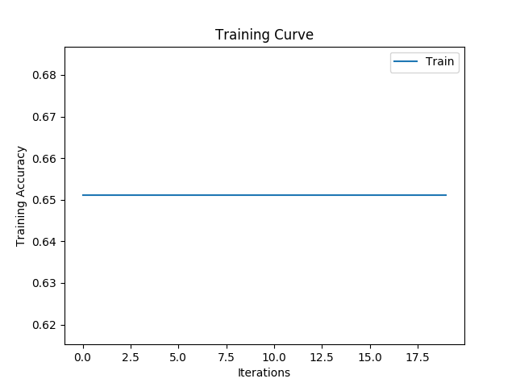

# Basic Neural Network
This repository serves as a basis for future learning projects. Instead 
of building a neural network from scratch, future projects will rely 
on this repository for a starting point. This repository uses
the small pima indians diabetes dataset. The architecture of the neural
network is detailed in this README. The following sections detail 
the folders and functions of the defined network. 

## Data Parsing:
The function used for data parsing is ```get_dataset(file_path)```. 
This function accepts a file path argument that details the name of the 
.csv data file. It will return a dataset object defined by the following
class:
```python
class Dataset():
    def __init__(self, inputs, labels):
        self.labels = labels
        self.inputs = inputs

    def __len__(self):
        return len(self.labels)

    def __getitem__(self, index):
        x = self.inputs[index]
        y = self.labels[index]

        return x, y
```
NOTE: The get_dataset function must be modified each time a new dataset
is introduced to the neural network.

## Training:
The train function offers tremendous functionality. This function trains
a PyTorch neural network and outputs many files. The following plots are
produced and stored in the "results" folder each time the train function
is called:
- training_accuracy.png
- training_loss.png
- validation_accuracy.png (if validation data is provided)
- validation_loss.png (if validation data is provided)
A sample of these plots is illustrated below:



*Figure 1: Training accuracy plot of basic fully connected neural network*

This function also produces files corresponding to parameter states. 
These files are saved into the model folder and the frequency of these
files is determined by the "checkpoint_frequency" argument. These 
files obey the following convention:
```python
# Example: basicFC_20_256_0.001
str(name) + '_' + str(current_iteration) + '_' + str(batch_size) + '_' + str(learning_rate)
```

## Architecture:
The model architecture is defined by the ```model_architecture.py``` file.
This file contains the PyTorch implementation of the desired model. The
model implemented in this repository is shown below:
```python
import torch

class FullyConnected(torch.nn.Module):
    def __init__(self):
        super(FullyConnected, self).__init__()

        input_size = 8
        hidden_layer_size = 32
        hidden_layer_2_size = 128
        hidden_layer_3_size = 32
        output_size = 1

        self.fc1 = torch.nn.Linear(input_size, hidden_layer_size)
        self.fc2 = torch.nn.Linear(hidden_layer_size, output_size)

        self.relu = torch.nn.ReLU()
        self.sigmoid = torch.nn.Sigmoid()


    def forward(self, x):
        x = self.fc1(x)
        x = self.relu(x)
        x = self.fc2(x)
        x = self.sigmoid(x)
        return x
```

## Testing:
To test a model, we load the state of the model from the "models" folder
into an empty model class. Then, we evaluate the model by running it on
the test set. The following code snippet illustrates the model parameter
extraction process:
```python

```
